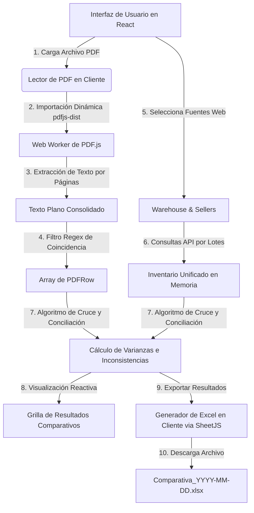

# Reporte Técnico de Arquitectura y Referencia: Sistema de Exportación y Comparación de Inventario

Este reporte describe en detalle el funcionamiento, diseño de software, modelado de datos y código de referencia del **Sistema de Exportación y Comparación de Inventario** implementado en la aplicación. Su objetivo es servir como un **plano técnico (blueprint)** completo y preciso que permita duplicar este sistema en cualquier otra plataforma o base de código Next.js/React.

---

## 1. Arquitectura de la Solución

El sistema está diseñado principalmente para ejecutarse en el **lado del cliente (client-side)** con el fin de evitar la sobrecarga del servidor en el procesamiento de archivos binarios pesados (como archivos PDF y libros de Excel). El flujo de procesamiento se visualiza a continuación:



### Componentes Clave:
1. **`ExportacionComparacion.tsx`**: Componente React contenedor principal que maneja los estados de exportación, carga de PDF, ejecución del parser y renderizado de la tabla comparativa interactiva.
2. **Lector y Parser de PDF**: Módulo embebido que utiliza un Web Worker en segundo plano para parsear archivos binarios PDF, extraer textos por página y buscar coincidencias de inventario mediante expresiones regulares (Regex).
3. **Servicios de Red (`api.ts`)**: Funciones encargadas de consultar las colecciones de productos por vendedores y almacén de manera asíncrona.
4. **Generador Excel (`xlsx`)**: Biblioteca en cliente que convierte arrays de objetos JSON en hojas de cálculo estilizadas y estructuradas con formato binario nativo de Excel.

---

## 2. Requisitos Previos y Dependencias

Para duplicar el sistema, es indispensable instalar y configurar las siguientes dependencias de NPM en el nuevo proyecto:

```json
{
  "dependencies": {
    "xlsx": "^0.18.5",
    "pdfjs-dist": "^4.4.168",
    "lucide-react": "^0.441.0",
    "class-variance-authority": "^0.7.0",
    "clsx": "^2.1.1",
    "tailwind-merge": "^2.5.2"
  }
}
```

> [!WARNING]
> **Compatibilidad SSR (Server-Side Rendering)**: `pdfjs-dist` y `xlsx` contienen APIs de navegador y referencias globales como `window` o `self`. Deben ser inicializados de forma puramente cliente para evitar fallos de compilación durante el pre-renderizado del framework (por ejemplo, en Next.js).

---

## 3. Modelado de Datos (TypeScript)

El sistema de comparación y exportación requiere que las entidades de datos respeten los siguientes esquemas estructurales.

```typescript
// Define las propiedades de una variante o parámetro del producto
export interface Parametro {
  nombre: string;
  cantidad: number;
  foto?: string;
  codigo_barras?: string; // Código de barras específico para esta variante
}

// Representa un producto en el inventario
export interface Producto {
  id: string;
  nombre: string;
  precio: number;
  precio_compra?: number; // Costo en moneda local
  cantidad: number;       // Cantidad base del producto (si no tiene parámetros)
  foto: string;
  tiene_parametros?: boolean;
  parametros?: Parametro[]; // Variaciones (ej. tallas, colores)
  descripcion?: string;
  codigo_barras?: string;  // Código de barras principal
}

// Representa a un vendedor asignado en el sistema
export interface Vendedor {
  id: string;
  nombre: string;
  productos: Producto[];
  rol: string;
}

// Estructura de fila mapeada directamente desde el parser del reporte PDF
export interface PDFRow {
  codigo: string;   // Código de barras detectado en el reporte físico
  cantidad: number; // Cantidad física contabilizada en el PDF
}

// Resultado final estructurado del cruce de datos
export interface ComparisonItem {
  codigo: string;          // Código de barras del producto
  productoNombre: string;  // Nombre descriptivo consolidado (incluyendo variante)
  cantidadWeb: number;     // Sumatoria de stock encontrada en el sistema web
  cantidadPDF: number;     // Cantidad reportada en el archivo PDF físico
  diferencia: number;      // cantidadWeb - cantidadPDF
  precioCompra: number;    // Costo de compra unitario para evaluar impacto financiero
}
```

---

## 4. El Sistema de Exportación a Excel (SheetJS)

El módulo de exportación recopila de forma reactiva información de múltiples orígenes y los estructura en una matriz plana para su conversión.

### Algoritmo de "Aplanado" de Variantes
Un producto puede ser simple o complejo (con variaciones/parámetros). Si un producto tiene variantes, exportar solo el producto base ignoraría el desglose real del inventario. El sistema ejecuta la siguiente lógica de aplanado de datos:

1. Si `tiene_parametros` es `true` y contiene elementos en el array `parametros`:
   - Itera por cada variante (`Parametro`).
   - Genera una nueva fila en el Excel donde el nombre del producto es: `Nombre original (Nombre de la variante)`.
   - Asigna el `codigo_barras` específico de la variante.
   - Asigna la `cantidad` de esa variante.
2. Si es un producto simple:
   - Exporta una única fila con los datos directos del producto.

### Código de Generación y Estilización con SheetJS
```typescript
// allData es un array plano de objetos con claves idénticas
const ws = XLSX.utils.json_to_sheet(allData, { 
  header: ["codigo", "producto", "cantidad", "precio de compra", "precio de venta"] 
});
const wb = XLSX.utils.book_new();
XLSX.utils.book_append_sheet(wb, ws, "Exportación");

// Configuración de anchos de columna personalizados (en caracteres)
ws['!cols'] = [
  { wch: 25 }, // Código de barras
  { wch: 50 }, // Nombre del Producto (con variantes)
  { wch: 10 }, // Cantidad física
  { wch: 15 }, // Costo unitario
  { wch: 15 }  // Precio de venta
];

// Escritura y descarga directa
XLSX.writeFile(wb, `Exportacion_${new Date().toISOString().split('T')[0]}.xlsx`);
```

---

## 5. El Sistema de Extracción y Comparación de PDF (PDF.js)

Esta es la sección más compleja del sistema. A continuación se desglosan las fases técnicas esenciales para replicar el lector y conciliador de PDF.

### A. Inicialización y Web Worker CDN
Para evitar bloquear el hilo de ejecución principal (Main Thread) del navegador mientras se analizan páginas binarias complejas, PDF.js requiere un Web Worker.
Dado que Next.js compila en servidor, el Worker se configura apuntando a un CDN público durante la carga dinámica:

```typescript
const pdfjs = await import('pdfjs-dist');
// Configura el worker desde un CDN confiable coincidiendo exactamente con la versión de npm install
pdfjs.GlobalWorkerOptions.workerSrc = `https://unpkg.com/pdfjs-dist@${pdfjs.version}/build/pdf.worker.min.mjs`;
```

### B. Polyfill de Seguridad: `Promise.withResolvers`
Las versiones modernas de `pdfjs-dist` dependen de la API de JavaScript moderna `Promise.withResolvers()`. Si el entorno de ejecución (navegador antiguo o ciertas configuraciones de Node) no lo soporta, el parser fallará inmediatamente. El sistema soluciona esto inyectando un polyfill antes de la llamada:

```typescript
if (typeof Promise.withResolvers === 'undefined') {
  Promise.withResolvers = function() {
    let resolve, reject;
    const promise = new Promise((res, rej) => {
      resolve = res;
      reject = rej;
    });
    return { promise, resolve, reject };
  };
}
```

### C. Lógica de Extracción de Texto Multilote
El lector carga el archivo en memoria como un búfer de datos (`ArrayBuffer`), instancia la promesa de carga de PDF y concatena el texto por cada página utilizando iteraciones:

```typescript
const arrayBuffer = await file.arrayBuffer();
const loadingTask = pdfjs.getDocument({ data: arrayBuffer });
const pdf = await loadingTask.promise;

let fullText = "";
for (let i = 1; i <= pdf.numPages; i++) {
  const page = await pdf.getPage(i);
  const textContent = await page.getTextContent();
  const pageText = textContent.items
    .map((item: any) => item.str || "")
    .join(" ");
  fullText += pageText + "\n";
}
```

### D. Estrategia Regex para Mapeo de Reportes Físicos
Para convertir la cadena de texto desestructurada extraída del PDF en un objeto con el formato `{ codigo: string, cantidad: number }`, el sistema aplica expresiones regulares específicas del formato del reporte.

#### Fórmula Regex Global (Estricta):
```javascript
const productRegex = /(\d{3}\.\d{3}\.\d{5})\s+(.*?)\s+U\s+(\d+(?:\.\d+)?)/g;
```
* **`(\d{3}\.\d{3}\.\d{5})`**: Grupo 1. Captura códigos formateados con puntos del tipo `123.456.78901` (máscara de código de barras común de almacén).
* **`\s+`**: Ignora uno o más espacios en blanco intermedios.
* **`(.*?)`**: Grupo 2. Captura perezosa (lazy) del nombre o descripción comercial del producto.
* **`\s+U\s+`**: Detecta la unidad de medida física fija en el reporte (`U` = Unidad).
* **`(\d+(?:\.\d+)?)`**: Grupo 3. Captura números enteros o decimales que representan la cantidad física del inventario (ej. `12` o `12.5`).

#### Fórmula Fallback (Línea por Línea):
Si la captura por bloque global no encuentra coincidencias, el parser divide el texto consolidado en saltos de línea (`\n`) y evalúa cada línea individualmente con una expresión regular ligeramente más tolerante:

```javascript
const lineMatch = line.match(/(\d{3}\.\d{3}\.\d{5})\s+.*?\s+U\s+(\d+(?:\.\d+)?)/);
```

### E. Conciliación y Cálculo de Discrepancias (Algoritmo de Cruce)
Una vez parseados los ítems del PDF, se crea un mapa asociativo de inventario web indexado por `codigo` para garantizar búsquedas en tiempo constante $O(1)$.
Este mapa agrupa las cantidades de los distintos vendedores seleccionados y el almacén:

```typescript
const webInventory: Record<string, { nombre: string, cantidad: number, precioCompra: number }> = {};

// 1. Agrega existencias del Almacén Central al mapa
almacen.forEach(prod => {
  if (prod.tiene_parametros && prod.parametros) {
    prod.parametros.forEach(param => {
      const code = param.codigo_barras || '';
      if (!code) return;
      if (!webInventory[code]) webInventory[code] = { nombre: `${prod.nombre} (${param.nombre})`, cantidad: 0, precioCompra: prod.precio_compra || 0 };
      webInventory[code].cantidad += param.cantidad;
    });
  } else {
    const code = prod.codigo_barras || '';
    if (!code) return;
    if (!webInventory[code]) webInventory[code] = { nombre: prod.nombre, cantidad: 0, precioCompra: prod.precio_compra || 0 };
    webInventory[code].cantidad += prod.cantidad;
  }
});

// 2. Agrega existencias de los Vendedores seleccionados al mapa
for (const vId of compareVendors) {
  const vProducts = await getProductosVendedor(vId);
  vProducts.forEach((prod: Producto) => {
    // ... misma lógica de parámetros que el almacén acumulando existencias en webInventory[code].cantidad ...
  });
}

// 3. Cruce directo
const results: ComparisonItem[] = [];
pdfData.forEach(pdfRow => {
  const webItem = webInventory[pdfRow.codigo];
  const cantWeb = webItem ? webItem.cantidad : 0;
  const nombre = webItem ? webItem.nombre : "No encontrado en base de datos";
  const pCompra = webItem ? webItem.precioCompra : 0;
  
  results.push({
    codigo: pdfRow.codigo,
    productoNombre: nombre,
    cantidadWeb: cantWeb,
    cantidadPDF: pdfRow.cantidad,
    diferencia: cantWeb - pdfRow.cantidad,
    precioCompra: pCompra
  });
});
```

---

## 6. Blueprint Completo: Código de Referencia

Este es el código fuente unificado y modularizado del componente `ExportacionComparacion.tsx`. Está completamente documentado para facilitar su replicación y adaptación.

```tsx
import React, { useState, useRef } from 'react';
import { Tabs, TabsContent, TabsList, TabsTrigger } from "@/components/ui/tabs";
import { Button } from "@/components/ui/button";
import { Plus, FileSpreadsheet, Download, Loader2, Upload, FileText, Check, AlertCircle, RefreshCw } from "lucide-react";
import { Dialog, DialogContent, DialogHeader, DialogTitle, DialogFooter } from "@/components/ui/dialog";
import { Checkbox } from "@/components/ui/checkbox";
import { Table, TableBody, TableCell, TableHead, TableHeader, TableRow } from "@/components/ui/table";
import { Vendedor, Producto } from '@/types';
import * as XLSX from 'xlsx';
import { getProductosVendedor } from '@/app/services/api';
import { toast } from "@/hooks/use-toast";

interface ExportacionComparacionProps {
  vendedores: Vendedor[];
  almacen: Producto[];
}

interface ComparisonItem {
  codigo: string;
  productoNombre: string;
  cantidadWeb: number;
  cantidadPDF: number;
  diferencia: number;
  precioCompra: number;
}

interface PDFRow {
  codigo: string;
  cantidad: number;
}

export default function ExportacionComparacion({ vendedores, almacen }: ExportacionComparacionProps) {
  const [activeTab, setActiveTab] = useState('exportacion');
  
  // Estados para Exportación
  const [showExportDialog, setShowExportDialog] = useState(false);
  const [selectedVendors, setSelectedVendors] = useState<string[]>([]);
  const [includeAlmacen, setIncludeAlmacen] = useState(false);
  const [isExporting, setIsExporting] = useState(false);

  // Estados para Comparación
  const [showCompareDialog, setShowCompareDialog] = useState(false);
  const [compareStep, setCompareStep] = useState(1);
  const [pdfData, setPdfData] = useState<PDFRow[]>([]);
  const [isParsingPDF, setIsParsingPDF] = useState(false);
  const [compareVendors, setCompareVendors] = useState<string[]>([]);
  const [compareIncludeAlmacen, setCompareIncludeAlmacen] = useState(false);
  const [comparisonResults, setComparisonResults] = useState<ComparisonItem[]>([]);
  const fileInputRef = useRef<HTMLInputElement>(null);

  // Alterna selección individual de vendedores en la exportación
  const handleToggleVendor = (id: string) => {
    setSelectedVendors(prev => 
      prev.includes(id) ? prev.filter(v => v !== id) : [...prev, id]
    );
  };

  // Genera reporte consolidado Excel
  const handleExport = async () => {
    if (selectedVendors.length === 0 && !includeAlmacen) {
      toast({
        title: "Error",
        description: "Selecciona al menos una opción para exportar",
        variant: "destructive"
      });
      return;
    }

    setIsExporting(true);
    try {
      let allData: any[] = [];

      // 1. Procesar existencias del Almacén Central
      if (includeAlmacen) {
        almacen.forEach(prod => {
          const hasParams = prod.tiene_parametros && prod.parametros && prod.parametros.length > 0;
          if (hasParams) {
            prod.parametros!.forEach(param => {
              allData.push({
                codigo: param.codigo_barras || '',
                producto: `${prod.nombre} (${param.nombre})`,
                cantidad: param.cantidad,
                'precio de compra': prod.precio_compra || 0,
                'precio de venta': prod.precio
              });
            });
          } else {
            allData.push({
              codigo: prod.codigo_barras || '',
              producto: prod.nombre,
              cantidad: prod.cantidad,
              'precio de compra': prod.precio_compra || 0,
              'precio de venta': prod.precio
            });
          }
        });
      }

      // 2. Procesar existencias de los Vendedores
      for (const vendorId of selectedVendors) {
        const vendor = vendedores.find(v => v.id === vendorId);
        if (!vendor) continue;
        try {
          const vendorProducts = await getProductosVendedor(vendorId);
          vendorProducts.forEach((prod: Producto) => {
            const hasParams = prod.tiene_parametros && prod.parametros && prod.parametros.length > 0;
            if (hasParams) {
              prod.parametros!.forEach(param => {
                allData.push({
                  codigo: param.codigo_barras || '',
                  producto: `${prod.nombre} (${param.nombre})`,
                  cantidad: param.cantidad,
                  'precio de compra': prod.precio_compra || 0,
                  'precio de venta': prod.precio
                });
              });
            } else {
              allData.push({
                codigo: prod.codigo_barras || '',
                producto: prod.nombre,
                cantidad: prod.cantidad,
                'precio de compra': prod.precio_compra || 0,
                'precio de venta': prod.precio
              });
            }
          });
        } catch (error) {
          console.error(`Error al obtener productos del vendedor ${vendor.nombre}:`, error);
        }
      }

      // 3. Crear hoja Excel
      const ws = XLSX.utils.json_to_sheet(allData, { header: ["codigo", "producto", "cantidad", "precio de compra", "precio de venta"] });
      const wb = XLSX.utils.book_new();
      XLSX.utils.book_append_sheet(wb, ws, "Exportación");
      ws['!cols'] = [{ wch: 25 }, { wch: 50 }, { wch: 10 }, { wch: 15 }, { wch: 15 }];
      XLSX.writeFile(wb, `Exportacion_${new Date().toISOString().split('T')[0]}.xlsx`);
      
      setShowExportDialog(false);
      toast({ title: "Éxito", description: "Exportación completada correctamente" });
    } catch (error) {
      console.error("Error al exportar a Excel:", error);
      toast({ title: "Error", description: "No se pudo realizar la exportación", variant: "destructive" });
    } finally {
      setIsExporting(false);
    }
  };

  // Maneja la carga de archivos PDF en el cliente y ejecuta el Parser
  const handleFileChange = async (e: React.ChangeEvent<HTMLInputElement>) => {
    const file = e.target.files?.[0];
    if (!file) return;

    if (file.type !== 'application/pdf') {
      toast({ title: "Error", description: "Por favor, sube un archivo PDF válido", variant: "destructive" });
      return;
    }

    setIsParsingPDF(true);
    try {
      // Inyección del Polyfill para compatibilidad con Promise.withResolvers en pdfjs
      if (typeof Promise.withResolvers === 'undefined') {
          (Promise as any).withResolvers = function() {
              let resolve, reject;
              const promise = new Promise((res, rej) => {
                  resolve = res;
                  reject = rej;
              });
              return { promise, resolve, reject };
          };
      }
      
      // Importación dinámica para prevenir errores en el servidor durante build de Next.js
      const pdfjs = await import('pdfjs-dist');
      // @ts-ignore
      pdfjs.GlobalWorkerOptions.workerSrc = `https://unpkg.com/pdfjs-dist@${pdfjs.version}/build/pdf.worker.min.mjs`;

      const arrayBuffer = await file.arrayBuffer();
      const loadingTask = pdfjs.getDocument({ data: arrayBuffer });
      const pdf = await loadingTask.promise;
      
      let fullText = "";

      // Lectura por lotes e hilado de textos planos
      for (let i = 1; i <= pdf.numPages; i++) {
        const page = await pdf.getPage(i);
        const textContent = await page.getTextContent();
        const pageText = textContent.items
          .map((item: any) => item.str || "")
          .join(" ");
        fullText += pageText + "\n";
      }

      const rows: PDFRow[] = [];
      // Regex global estricta para buscar coincidencias de columnas del reporte
      const productRegex = /(\d{3}\.\d{3}\.\d{5})\s+(.*?)\s+U\s+(\d+(?:\.\d+)?)/g;
      
      let match;
      while ((match = productRegex.exec(fullText)) !== null) {
        rows.push({
          codigo: match[1],
          cantidad: parseFloat(match[3])
        });
      }

      // Regex fallback línea por línea en caso de cadenas desordenadas
      if (rows.length === 0) {
        const lines = fullText.split('\n');
        lines.forEach(line => {
           const lineMatch = line.match(/(\d{3}\.\d{3}\.\d{5})\s+.*?\s+U\s+(\d+(?:\.\d+)?)/);
           if (lineMatch) {
             rows.push({ codigo: lineMatch[1], cantidad: parseFloat(lineMatch[2]) });
           }
        });
      }

      if (rows.length === 0) {
        toast({ 
          title: "Aviso", 
          description: "No se detectaron productos estructurados en el PDF. Revisa el formato.", 
          variant: "destructive" 
        });
      } else {
        setPdfData(rows);
        setCompareStep(2); // Avanza al siguiente paso del asistente
        toast({ title: "PDF Procesado", description: `Se detectaron ${rows.length} productos.` });
      }
    } catch (error: any) {
      console.error("Error al parsear el archivo PDF:", error);
      toast({ title: "Error", description: `Error al procesar: ${error.message || "Error desconocido"}`, variant: "destructive" });
    } finally {
      setIsParsingPDF(false);
      if (e.target) e.target.value = ''; // Resetea el input file
    }
  };

  // Cruza datos del PDF contra los inventarios seleccionados (Almacén y/o Vendedores)
  const handleStartComparison = async () => {
    if (compareVendors.length === 0 && !compareIncludeAlmacen) {
      toast({ title: "Error", description: "Selecciona al menos una fuente para la comparativa", variant: "destructive" });
      return;
    }

    setIsExporting(true);
    try {
      const webInventory: Record<string, { nombre: string, cantidad: number, precioCompra: number }> = {};

      // 1. Agrupar existencias del Almacén Central
      if (compareIncludeAlmacen) {
        almacen.forEach(prod => {
          if (prod.tiene_parametros && prod.parametros) {
            prod.parametros.forEach(param => {
              const code = param.codigo_barras || '';
              if (!code) return;
              if (!webInventory[code]) webInventory[code] = { nombre: `${prod.nombre} (${param.nombre})`, cantidad: 0, precioCompra: prod.precio_compra || 0 };
              webInventory[code].cantidad += param.cantidad;
            });
          } else {
            const code = prod.codigo_barras || '';
            if (!code) return;
            if (!webInventory[code]) webInventory[code] = { nombre: prod.nombre, cantidad: 0, precioCompra: prod.precio_compra || 0 };
            webInventory[code].cantidad += prod.cantidad;
          }
        });
      }

      // 2. Agrupar existencias de los Vendedores seleccionados
      for (const vId of compareVendors) {
        const vProducts = await getProductosVendedor(vId);
        vProducts.forEach((prod: Producto) => {
          if (prod.tiene_parametros && prod.parametros) {
            prod.parametros.forEach(param => {
              const code = param.codigo_barras || '';
              if (!code) return;
              if (!webInventory[code]) webInventory[code] = { nombre: `${prod.nombre} (${param.nombre})`, cantidad: 0, precioCompra: prod.precio_compra || 0 };
              webInventory[code].cantidad += param.cantidad;
            });
          } else {
            const code = prod.codigo_barras || '';
            if (!code) return;
            if (!webInventory[code]) webInventory[code] = { nombre: prod.nombre, cantidad: 0, precioCompra: prod.precio_compra || 0 };
            webInventory[code].cantidad += prod.cantidad;
          }
        });
      }

      // 3. Cruzar datos e identificar discrepancias
      const results: ComparisonItem[] = [];
      pdfData.forEach(pdfRow => {
        const webItem = webInventory[pdfRow.codigo];
        const cantWeb = webItem ? webItem.cantidad : 0;
        const nombre = webItem ? webItem.nombre : "No encontrado en la web";
        const pCompra = webItem ? webItem.precioCompra : 0;
        
        results.push({
          codigo: pdfRow.codigo,
          productoNombre: nombre,
          cantidadWeb: cantWeb,
          cantidadPDF: pdfRow.cantidad,
          diferencia: cantWeb - pdfRow.cantidad,
          precioCompra: pCompra
        });
      });

      setComparisonResults(results);
      setShowCompareDialog(false);
      setCompareStep(1);
      setPdfData([]);
      toast({ title: "Éxito", description: "Comparación calculada correctamente" });
    } catch (error) {
      console.error("Error al procesar la comparación:", error);
      toast({ title: "Error", description: "Error al cruzar datos", variant: "destructive" });
    } finally {
      setIsExporting(false);
    }
  };

  // Exporta los resultados finales de la grilla comparativa
  const exportComparisonToExcel = () => {
    const data = comparisonResults.map(item => ({
      'Código': item.codigo,
      'Producto': item.productoNombre,
      'Precio de Compra': item.precioCompra,
      'Cantidad Web': item.cantidadWeb,
      'Cantidad PDF': item.cantidadPDF,
      'Diferencia': item.diferencia
    }));

    const ws = XLSX.utils.json_to_sheet(data);
    const wb = XLSX.utils.book_new();
    XLSX.utils.book_append_sheet(wb, ws, "Comparativa");
    ws['!cols'] = [{ wch: 20 }, { wch: 40 }, { wch: 15 }, { wch: 15 }, { wch: 15 }, { wch: 15 }];
    XLSX.writeFile(wb, `Comparativa_${new Date().toISOString().split('T')[0]}.xlsx`);
  };

  return (
    <div className="space-y-4">
      <Tabs value={activeTab} onValueChange={setActiveTab} className="w-full">
        <TabsList className="grid w-full grid-cols-2">
          <TabsTrigger value="exportacion">Exportación</TabsTrigger>
          <TabsTrigger value="comparacion">Comparación</TabsTrigger>
        </TabsList>
        
        <TabsContent value="exportacion" className="mt-4 p-4 border rounded-lg bg-card">
          <div className="flex flex-col sm:flex-row justify-between items-start sm:items-center gap-4 mb-6">
            <h2 className="text-xl font-semibold">Generar Exportación Consolidada</h2>
            <Button onClick={() => setShowExportDialog(true)} className="w-full sm:w-auto bg-green-600 hover:bg-green-700 text-white">
              <Plus className="mr-2 h-4 w-4" /> Nueva Exportación
            </Button>
          </div>
          <div className="flex flex-col items-center justify-center py-12 text-muted-foreground border-2 border-dashed rounded-lg bg-gray-50/50">
            <div className="bg-white p-4 rounded-full shadow-sm mb-4">
                <FileSpreadsheet className="h-10 w-10 text-green-600" />
            </div>
            <p className="text-sm font-medium">Exporta las existencias del sistema a Excel</p>
            <p className="text-xs mt-1">Permite seleccionar de forma selectiva vendedores e inventario central.</p>
          </div>
        </TabsContent>
        
        <TabsContent value="comparacion" className="mt-4 p-4 border rounded-lg bg-card min-h-[400px]">
          {comparisonResults.length > 0 ? (
            <div className="space-y-4">
              <div className="flex flex-col sm:flex-row justify-between items-start sm:items-center gap-4">
                <h2 className="text-xl font-bold">Resultados del Cruce</h2>
                <div className="flex gap-2 w-full sm:w-auto">
                  <Button variant="outline" onClick={() => setComparisonResults([])} className="flex-1 sm:flex-none">
                    <RefreshCw className="mr-2 h-4 w-4" /> Resetear
                  </Button>
                  <Button onClick={exportComparisonToExcel} className="flex-1 sm:flex-none bg-green-600 hover:bg-green-700 text-white">
                    <Download className="mr-2 h-4 w-4" /> Exportar Tabla (.xlsx)
                  </Button>
                </div>
              </div>
              <div className="border rounded-lg overflow-x-auto">
                <Table>
                  <TableHeader className="bg-gray-50">
                    <TableRow>
                      <TableHead className="min-w-[120px]">Código</TableHead>
                      <TableHead className="min-w-[200px]">Producto</TableHead>
                      <TableHead className="text-center">Cant. Web</TableHead>
                      <TableHead className="text-center">Cant. PDF</TableHead>
                      <TableHead className="text-center">Diferencia</TableHead>
                    </TableRow>
                  </TableHeader>
                  <TableBody>
                    {comparisonResults.map((item, idx) => (
                      <TableRow key={idx}>
                        <TableCell className="font-mono text-xs py-2">{item.codigo}</TableCell>
                        <TableCell className="max-w-[250px] truncate py-2 text-sm">{item.productoNombre}</TableCell>
                        <TableCell className="text-center font-bold text-blue-600 bg-blue-50/30 py-2 text-sm">{item.cantidadWeb}</TableCell>
                        <TableCell className="text-center font-bold text-purple-600 bg-purple-50/30 py-2 text-sm">{item.cantidadPDF}</TableCell>
                        <TableCell className={`text-center font-bold py-2 text-sm ${item.diferencia === 0 ? 'text-green-600' : 'text-red-600'}`}>
                          {item.diferencia > 0 ? `+${item.diferencia}` : item.diferencia}
                        </TableCell>
                      </TableRow>
                    ))}
                  </TableBody>
                </Table>
              </div>
            </div>
          ) : (
            <div className="flex flex-col items-center justify-center py-20 text-center">
              <div className="bg-purple-100 p-6 rounded-full mb-4">
                <FileText className="h-12 w-12 text-purple-600" />
              </div>
              <h3 className="text-lg font-semibold">Comparar PDF Físico vs Inventario Web</h3>
              <p className="text-muted-foreground max-w-md mt-2">
                Sube un reporte físico en PDF para identificar inconsistencias y faltantes de inventario de forma automatizada.
              </p>
              <Button onClick={() => setShowCompareDialog(true)} className="mt-6 bg-purple-600 hover:bg-purple-700 text-white">
                <Plus className="mr-2 h-4 w-4" /> Iniciar Cruce de Inventarios
              </Button>
            </div>
          )}
        </TabsContent>
      </Tabs>

      {/* DIÁLOGO MULTIPASO PARA LA COMPARATIVA */}
      <Dialog open={showCompareDialog} onOpenChange={(open) => {
        setShowCompareDialog(open);
        if (!open) {
          setCompareStep(1);
          setPdfData([]);
          setCompareVendors([]);
          setCompareIncludeAlmacen(false);
        }
      }}>
        <DialogContent className="sm:max-w-[500px]">
          <DialogHeader>
            <DialogTitle>Asistente de Comparativa - Paso {compareStep} de 2</DialogTitle>
          </DialogHeader>

          {compareStep === 1 && (
            <div className="py-8 flex flex-col items-center justify-center space-y-4">
              <div 
                className="w-full border-2 border-dashed border-purple-200 rounded-xl p-8 flex flex-col items-center justify-center bg-purple-50/30 hover:bg-purple-50 transition-colors cursor-pointer group"
                onClick={() => fileInputRef.current?.click()}
              >
                {isParsingPDF ? (
                  <div className="flex flex-col items-center">
                    <Loader2 className="h-12 w-12 text-purple-600 animate-spin mb-4" />
                    <p className="text-sm font-medium">Analizando estructura binaria...</p>
                  </div>
                ) : (
                  <>
                    <Upload className="h-12 w-12 text-purple-400 mb-4 group-hover:scale-110 transition-transform" />
                    <p className="text-sm font-semibold text-center">Subir reporte en formato PDF</p>
                    <p className="text-xs text-muted-foreground mt-1 text-center">
                      El motor buscará automáticamente columnas con códigos de barra y cantidades.
                    </p>
                  </>
                )}
                <input 
                  type="file" 
                  ref={fileInputRef} 
                  className="hidden" 
                  accept=".pdf" 
                  onChange={handleFileChange} 
                />
              </div>
              <div className="flex items-start gap-2 text-xs text-gray-500 bg-gray-50 p-3 rounded-lg border">
                <AlertCircle className="h-4 w-4 text-orange-500 flex-shrink-0" />
                <p>Asegúrate de que el PDF contenga códigos limpios formateados (ej. 123.456.78901) acompañados de su cantidad.</p>
              </div>
            </div>
          )}

          {compareStep === 2 && (
            <div className="py-4 space-y-6">
              <div className="flex items-center justify-between bg-green-50 p-3 rounded-lg border border-green-100">
                <div className="flex items-center gap-2">
                  <Check className="h-4 w-4 text-green-600 flex-shrink-0" />
                  <span className="text-sm font-medium text-green-800">PDF leido: {pdfData.length} productos detectados</span>
                </div>
                <Button variant="ghost" size="sm" onClick={() => setCompareStep(1)} className="text-xs h-7">Cambiar PDF</Button>
              </div>

              <div className="space-y-4">
                <h3 className="text-sm font-bold text-gray-700">Cruzar contra las siguientes fuentes del sistema:</h3>
                
                <div className="flex items-center space-x-3 p-3 bg-gray-50 rounded-lg border">
                  <Checkbox 
                    id="compare-almacen" 
                    checked={compareIncludeAlmacen} 
                    onCheckedChange={(checked) => setCompareIncludeAlmacen(checked === true)}
                  />
                  <label htmlFor="compare-almacen" className="flex-grow font-semibold cursor-pointer text-sm">Almacén Central (Stock Principal)</label>
                </div>

                <div className="space-y-3">
                  <div className="flex items-center justify-between">
                    <h4 className="text-xs font-bold text-gray-400 uppercase tracking-wider">Existencias por Vendedores</h4>
                  </div>
                  <div className="max-h-48 overflow-y-auto space-y-1 pr-2 border rounded-md p-2">
                    {vendedores.map(v => (
                      <div key={v.id} className="flex items-center space-x-3 p-2 hover:bg-gray-50 rounded-md transition-colors">
                        <Checkbox 
                          id={`compare-v-${v.id}`} 
                          checked={compareVendors.includes(v.id)} 
                          onCheckedChange={() => setCompareVendors(prev => 
                            prev.includes(v.id) ? prev.filter(id => id !== v.id) : [...prev, v.id]
                          )} 
                        />
                        <label htmlFor={`compare-v-${v.id}`} className="flex-grow text-sm cursor-pointer">{v.nombre}</label>
                      </div>
                    ))}
                  </div>
                </div>
              </div>

              <DialogFooter className="flex gap-2 pt-4">
                <Button variant="outline" onClick={() => setCompareStep(1)} className="w-full sm:w-auto">Atrás</Button>
                <Button 
                  onClick={handleStartComparison} 
                  disabled={isExporting || (compareVendors.length === 0 && !compareIncludeAlmacen)}
                  className="w-full sm:w-auto bg-purple-600 hover:bg-purple-700 text-white"
                >
                  {isExporting ? <><Loader2 className="mr-2 h-4 w-4 animate-spin" /> Procesando...</> : "Confirmar y Ejecutar Cruce"}
                </Button>
              </DialogFooter>
            </div>
          )}
        </DialogContent>
      </Dialog>

      {/* DIÁLOGO SELECCIÓN EXPORTACIÓN */}
      <Dialog open={showExportDialog} onOpenChange={setShowExportDialog}>
        <DialogContent className="sm:max-w-[425px]">
          <DialogHeader>
            <DialogTitle>Generar Plantilla Excel</DialogTitle>
          </DialogHeader>
          <div className="py-4 space-y-6">
            <div className="flex items-center space-x-3 p-3 bg-gray-50 rounded-lg border">
              <Checkbox id="almacen-check" checked={includeAlmacen} onCheckedChange={(checked) => setIncludeAlmacen(checked === true)} />
              <label htmlFor="almacen-check" className="flex-grow font-semibold cursor-pointer text-sm">Incluir Almacén Central</label>
            </div>
            <div className="space-y-3">
              <div className="flex items-center justify-between">
                <h3 className="text-xs font-bold text-gray-500 uppercase">Incluir inventario de Vendedores</h3>
                <Button variant="link" size="sm" className="h-auto p-0 text-xs text-blue-600" onClick={() => setSelectedVendors(selectedVendors.length === vendedores.length ? [] : vendedores.map(v => v.id))}>
                  {selectedVendors.length === vendedores.length ? 'Deseleccionar todos' : 'Seleccionar todos'}
                </Button>
              </div>
              <div className="max-h-60 overflow-y-auto space-y-1 border rounded-md p-2">
                {vendedores.map(v => (
                  <div key={v.id} className="flex items-center space-x-3 p-2 hover:bg-gray-50 rounded-md transition-colors">
                    <Checkbox id={`vendedor-check-${v.id}`} checked={selectedVendors.includes(v.id)} onCheckedChange={() => handleToggleVendor(v.id)} />
                    <label htmlFor={`vendedor-check-${v.id}`} className="flex-grow text-sm cursor-pointer">{v.nombre}</label>
                  </div>
                ))}
              </div>
            </div>
          </div>
          <DialogFooter className="flex gap-2">
            <Button variant="ghost" onClick={() => setShowExportDialog(false)} className="w-full sm:w-auto">Cancelar</Button>
            <Button onClick={handleExport} disabled={isExporting || (selectedVendors.length === 0 && !includeAlmacen)} className="w-full sm:w-auto bg-green-600 hover:bg-green-700 text-white">
              {isExporting ? <><Loader2 className="mr-2 h-4 w-4 animate-spin" /> Generando...</> : <><Download className="mr-2 h-4 w-4" /> Generar Excel</>}
            </Button>
          </DialogFooter>
        </DialogContent>
      </Dialog>
    </div>
  );
}
```

---

## 7. Directrices de UX/UI y Estilización Replicable

Para que el sistema mantenga su alto nivel estético e interactivo, la interfaz debe aplicar las siguientes directrices de diseño (utilizando las utilidades estándar de Tailwind CSS o clases equivalentes):

1. **Botones de Acción**:
   * Los botones de **Excel (`.xlsx`)** utilizan colores verdes consistentes con Microsoft Excel: `bg-green-600 hover:bg-green-700 text-white`.
   * Los botones de **Comparación / Lector PDF** se destacan con tonalidades púrpuras: `bg-purple-600 hover:bg-purple-700 text-white`.
2. **Tablas Reactivas de Resultados**:
   * Las columnas clave como `Cant. Web` y `Cant. PDF` poseen píldoras y fondos con tonalidades atenuadas para facilitar la lectura del usuario:
     - Cantidad Web: `text-blue-600 bg-blue-50/30`.
     - Cantidad PDF: `text-purple-600 bg-purple-50/30`.
   * La columna `Diferencia` se calcula de forma dinámica y colorea su texto en tiempo real:
     - Si la varianza es igual a `0` (inventario conciliado perfecto): `text-green-600`.
     - Si hay sobrantes o faltantes (varianza menor o mayor a `0`): `text-red-600`.
3. **Áreas de Soltar Archivos (Drag & Drop Mock)**:
   * El asistente de subida posee un borde discontinuo animado al pasar el cursor encima, lo que proporciona una excelente experiencia interactiva táctil y visual: `border-2 border-dashed border-purple-200 bg-purple-50/30 hover:bg-purple-50 transition-colors`.

---

## 8. Recomendaciones de Control de Calidad y Escalabilidad

1. **Gestión de Memoria en Archivos Gigantes**:
   * Al procesar PDFs extremadamente largos (+100 páginas), la concatenación de texto plano en memoria de navegador puede causar picos de consumo de recursos. Se aconseja incorporar una barra de carga real que dibuje el progreso por lotes usando el contador nativo: `(i / pdf.numPages) * 100`.
2. **Normalización de Cadenas en Comparación**:
   * Las claves de cruce (`codigo`) deben sanitizarse rigurosamente antes de indexarlas en `webInventory`. Aplique un recorte de espacios y conversión a minúsculas: `codigo.trim().toLowerCase()`.
3. **Manejo de Variaciones sin Código de Barras**:
   * Si una variante de producto carece de código de barras físico en la base de datos, el sistema de cruce omitirá dicho ítem. Asegúrese de que el formulario de creación de productos obligue al usuario a asignar códigos EAN-13/UPC individuales para cada parámetro variante activo en el inventario.
4. **Manejo de Concurrencia de Red**:
   * Al seleccionar múltiples vendedores, el componente realiza una solicitud de red por cada vendedor de forma secuencial (`for (const vendorId of selectedVendors)`). Si el número de vendedores supera los 20, se recomienda paralelizar las llamadas utilizando `Promise.all` para optimizar drásticamente la latencia en el cliente:
     ```typescript
     const allPromises = selectedVendors.map(id => getProductosVendedor(id));
     const allVendorProducts = await Promise.all(allPromises);
     ```
